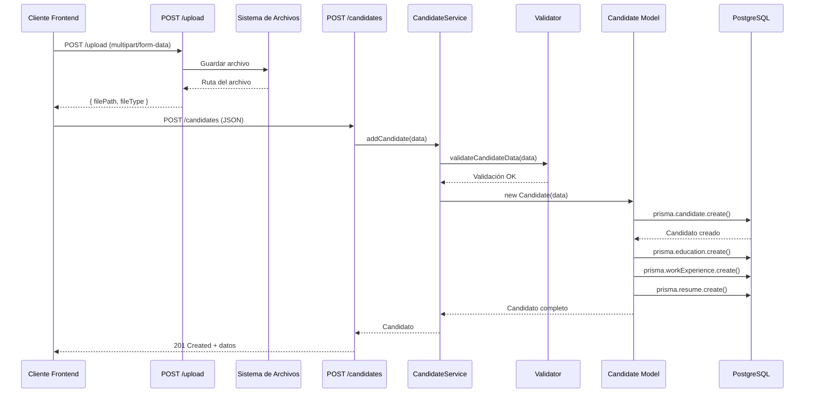

# Especificaciones de la API

## Información General

- **Base URL**: `http://localhost:3010`
- **Versión**: 1.0.0
- **Formato**: JSON
- **Especificación**: OpenAPI 3.0.0 (definida en `backend/api-spec.yaml`)

## Endpoints

### POST /candidates

Añade un nuevo candidato al sistema.

**Método**: `POST`  
**Ruta**: `/candidates`  
**Descripción**: Crea un nuevo candidato con su información personal, educación, experiencia laboral y CV.

**Request Body:**
```json
{
  "firstName": "Juan",
  "lastName": "Pérez",
  "email": "juan.perez@example.com",
  "phone": "656874937",
  "address": "Calle Ejemplo 123, Madrid",
  "educations": [
    {
      "institution": "Universidad Complutense",
      "title": "Ingeniería Informática",
      "startDate": "2010-09-01",
      "endDate": "2014-06-30"
    }
  ],
  "workExperiences": [
    {
      "company": "Tech Corp",
      "position": "Desarrollador Senior",
      "description": "Desarrollo de aplicaciones web",
      "startDate": "2015-01-15",
      "endDate": "2020-03-31"
    }
  ],
  "cv": {
    "filePath": "uploads/1715760936750-cv.pdf",
    "fileType": "application/pdf"
  }
}
```

**Validaciones:**
- `firstName`: String, 2-100 caracteres, solo letras y espacios
- `lastName`: String, 2-100 caracteres, solo letras y espacios
- `email`: String, formato email válido, único
- `phone`: String opcional, formato español (6, 7, 9 seguido de 8 dígitos)
- `address`: String opcional, máximo 100 caracteres
- `educations`: Array opcional de objetos Education
- `workExperiences`: Array opcional de objetos WorkExperience
- `cv`: Objeto opcional con `filePath` y `fileType`

**Response 201 Created:**
```json
{
  "message": "Candidate added successfully",
  "data": {
    "id": 1,
    "firstName": "Juan",
    "lastName": "Pérez",
    "email": "juan.perez@example.com",
    "phone": "656874937",
    "address": "Calle Ejemplo 123, Madrid",
    "educations": [
      {
        "id": 1,
        "institution": "Universidad Complutense",
        "title": "Ingeniería Informática",
        "startDate": "2010-09-01T00:00:00.000Z",
        "endDate": "2014-06-30T00:00:00.000Z",
        "candidateId": 1
      }
    ],
    "workExperiences": [
      {
        "id": 1,
        "company": "Tech Corp",
        "position": "Desarrollador Senior",
        "description": "Desarrollo de aplicaciones web",
        "startDate": "2015-01-15T00:00:00.000Z",
        "endDate": "2020-03-31T00:00:00.000Z",
        "candidateId": 1
      }
    ],
    "resumes": [
      {
        "id": 1,
        "filePath": "uploads/1715760936750-cv.pdf",
        "fileType": "application/pdf",
        "uploadDate": "2024-05-15T10:30:00.000Z",
        "candidateId": 1
      }
    ]
  }
}
```

**Response 400 Bad Request:**
```json
{
  "message": "Error adding candidate",
  "error": "Invalid email"
}
```

**Errores posibles:**
- `400`: Datos inválidos (validación fallida)
- `400`: Email ya existe en la base de datos
- `500`: Error interno del servidor

---

### GET /candidates/:id

Obtiene un candidato por su ID.

**Método**: `GET`  
**Ruta**: `/candidates/:id`  
**Descripción**: Retorna la información completa de un candidato incluyendo educación, experiencia, CVs y aplicaciones.

**Parámetros de URL:**
- `id` (Integer, requerido): ID del candidato

**Response 200 OK:**
```json
{
  "id": 1,
  "firstName": "Juan",
  "lastName": "Pérez",
  "email": "juan.perez@example.com",
  "phone": "656874937",
  "address": "Calle Ejemplo 123, Madrid",
  "educations": [
    {
      "id": 1,
      "institution": "Universidad Complutense",
      "title": "Ingeniería Informática",
      "startDate": "2010-09-01T00:00:00.000Z",
      "endDate": "2014-06-30T00:00:00.000Z",
      "candidateId": 1
    }
  ],
  "workExperiences": [
    {
      "id": 1,
      "company": "Tech Corp",
      "position": "Desarrollador Senior",
      "startDate": "2015-01-15T00:00:00.000Z",
      "endDate": "2020-03-31T00:00:00.000Z",
      "candidateId": 1
    }
  ],
  "resumes": [
    {
      "id": 1,
      "filePath": "uploads/1715760936750-cv.pdf",
      "fileType": "application/pdf",
      "uploadDate": "2024-05-15T10:30:00.000Z",
      "candidateId": 1
    }
  ],
  "applications": [
    {
      "id": 1,
      "positionId": 1,
      "candidateId": 1,
      "applicationDate": "2024-05-20T09:00:00.000Z",
      "currentInterviewStep": 1,
      "notes": null,
      "position": {
        "id": 1,
        "title": "Desarrollador Full Stack"
      },
      "interviews": [
        {
          "interviewDate": "2024-05-25T10:00:00.000Z",
          "interviewStep": {
            "name": "Entrevista Técnica"
          },
          "score": 8,
          "notes": "Excelente conocimiento técnico"
        }
      ]
    }
  ]
}
```

**Response 400 Bad Request:**
```json
{
  "error": "Invalid ID format"
}
```

**Response 404 Not Found:**
```json
{
  "error": "Candidate not found"
}
```

**Response 500 Internal Server Error:**
```json
{
  "error": "Internal Server Error"
}
```

---

### PUT /candidates/:id

Actualiza la etapa de entrevista de un candidato.

**Método**: `PUT`  
**Ruta**: `/candidates/:id`  
**Descripción**: Actualiza el paso actual de entrevista de una aplicación específica de un candidato.

**Parámetros de URL:**
- `id` (Integer, requerido): ID del candidato

**Request Body:**
```json
{
  "applicationId": 1,
  "currentInterviewStep": 2
}
```

**Validaciones:**
- `applicationId`: Integer, requerido
- `currentInterviewStep`: Integer, requerido, debe existir en InterviewStep

**Response 200 OK:**
```json
{
  "message": "Candidate stage updated successfully",
  "data": {
    "id": 1,
    "positionId": 1,
    "candidateId": 1,
    "applicationDate": "2024-05-20T09:00:00.000Z",
    "currentInterviewStep": 2,
    "notes": null,
    "interviews": [
      {
        "interviewDate": "2024-05-25T10:00:00.000Z",
        "interviewStep": "Entrevista Técnica",
        "score": 8
      }
    ]
  }
}
```

**Response 400 Bad Request:**
```json
{
  "message": "Error updating candidate stage",
  "error": "Invalid position ID format"
}
```

**Response 404 Not Found:**
```json
{
  "message": "Application not found",
  "error": "Error: Application not found"
}
```

---

### POST /upload

Sube un archivo (CV) al servidor.

**Método**: `POST`  
**Ruta**: `/upload`  
**Descripción**: Sube un archivo PDF o DOCX al servidor y retorna la ruta y tipo del archivo.

**Content-Type**: `multipart/form-data`

**Request Body:**
- `file` (File, requerido): Archivo a subir (PDF o DOCX, máximo 10MB)

**Validaciones:**
- Tipo de archivo: Solo `application/pdf` o `application/vnd.openxmlformats-officedocument.wordprocessingml.document`
- Tamaño máximo: 10MB

**Response 200 OK:**
```json
{
  "filePath": "uploads/1715760936750-cv.pdf",
  "fileType": "application/pdf"
}
```

**Response 400 Bad Request:**
```json
{
  "error": "Invalid file type, only PDF and DOCX are allowed!"
}
```

**Response 500 Internal Server Error:**
```json
{
  "error": "Error during the file upload process"
}
```

---

### GET /position/:id/candidates

Obtiene todos los candidatos de una posición específica.

**Método**: `GET`  
**Ruta**: `/position/:id/candidates`  
**Descripción**: Retorna una lista de candidatos que han aplicado a una posición, incluyendo su etapa actual de entrevista y puntuación promedio.

**Parámetros de URL:**
- `id` (Integer, requerido): ID de la posición

**Response 200 OK:**
```json
[
  {
    "fullName": "Juan Pérez",
    "currentInterviewStep": "Entrevista Técnica",
    "averageScore": 8.5,
    "id": 1,
    "applicationId": 1
  },
  {
    "fullName": "María García",
    "currentInterviewStep": "Entrevista Cultural",
    "averageScore": 7.0,
    "id": 2,
    "applicationId": 2
  }
]
```

**Response 500 Internal Server Error:**
```json
{
  "message": "Error retrieving candidates",
  "error": "Error retrieving candidates by position"
}
```

---

### GET /position/:id/interviewflow

Obtiene el flujo de entrevistas de una posición.

**Método**: `GET`  
**Ruta**: `/position/:id/interviewflow`  
**Descripción**: Retorna el flujo de entrevistas configurado para una posición, incluyendo todos los pasos ordenados.

**Parámetros de URL:**
- `id` (Integer, requerido): ID de la posición

**Response 200 OK:**
```json
{
  "positionName": "Desarrollador Full Stack",
  "interviewFlow": {
    "id": 1,
    "description": "Flujo estándar de entrevistas técnicas",
    "interviewSteps": [
      {
        "id": 1,
        "interviewFlowId": 1,
        "interviewTypeId": 1,
        "name": "Screening Inicial",
        "orderIndex": 1
      },
      {
        "id": 2,
        "interviewFlowId": 1,
        "interviewTypeId": 2,
        "name": "Entrevista Técnica",
        "orderIndex": 2
      },
      {
        "id": 3,
        "interviewFlowId": 1,
        "interviewTypeId": 3,
        "name": "Entrevista Cultural",
        "orderIndex": 3
      }
    ]
  }
}
```

**Response 404 Not Found:**
```json
{
  "message": "Position not found",
  "error": "Position not found"
}
```

## Manejo de Errores

### Códigos HTTP

- **200 OK**: Operación exitosa
- **201 Created**: Recurso creado exitosamente
- **400 Bad Request**: Datos inválidos o error de validación
- **404 Not Found**: Recurso no encontrado
- **500 Internal Server Error**: Error interno del servidor

### Formato de Errores

Todos los errores siguen un formato consistente:

```json
{
  "message": "Descripción del error",
  "error": "Detalle técnico del error"
}
```

O formato simplificado:

```json
{
  "error": "Mensaje de error"
}
```

## Cabeceras HTTP

### Request Headers

- `Content-Type: application/json` (para JSON)
- `Content-Type: multipart/form-data` (para uploads)

### Response Headers

- `Content-Type: application/json`
- `Access-Control-Allow-Origin: http://localhost:3000` (CORS)

## Versionado de API

**Estado actual**: Sin versionado explícito en URLs.

**Recomendación**: Implementar versionado cuando haya cambios breaking:
- `/api/v1/candidates`
- `/api/v2/candidates`

## Políticas de Compatibilidad

[POR COMPLETAR] No hay política formal de compatibilidad definida.

**Recomendación**:
- Mantener compatibilidad hacia atrás durante al menos 6 meses
- Usar versionado para cambios breaking
- Documentar deprecaciones con suficiente antelación

## Ejemplo de Flujo Completo

### Sequence Diagram: Crear Candidato con CV



## Notas Adicionales

- Todos los endpoints requieren CORS desde `http://localhost:3000`
- Las fechas se manejan en formato ISO 8601
- Los IDs son enteros autoincrementales
- El email de candidatos debe ser único en el sistema
- Los archivos se almacenan en `../uploads/` relativo al backend

