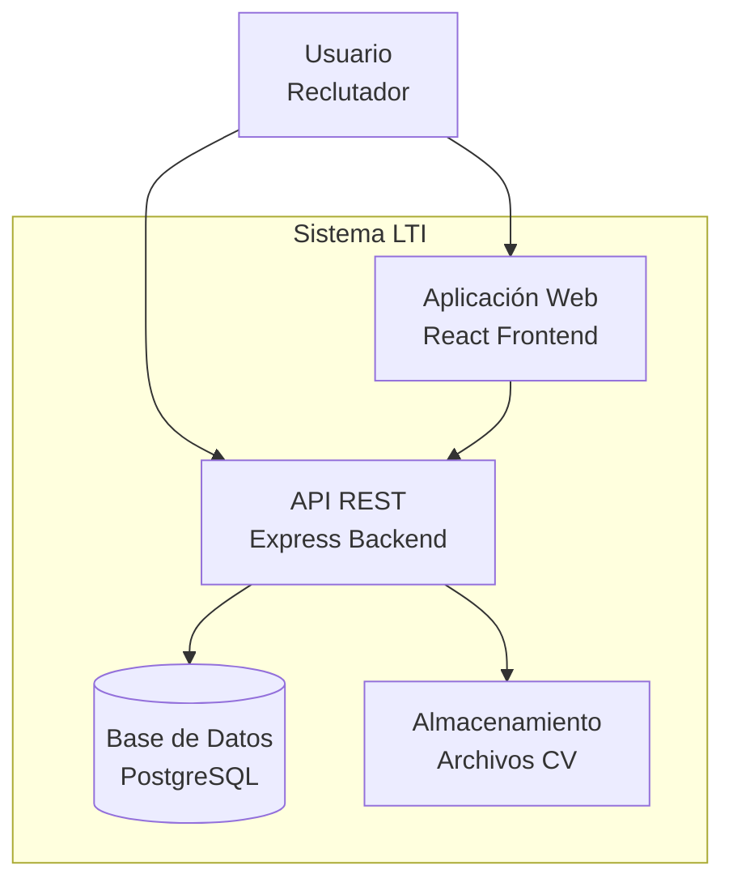
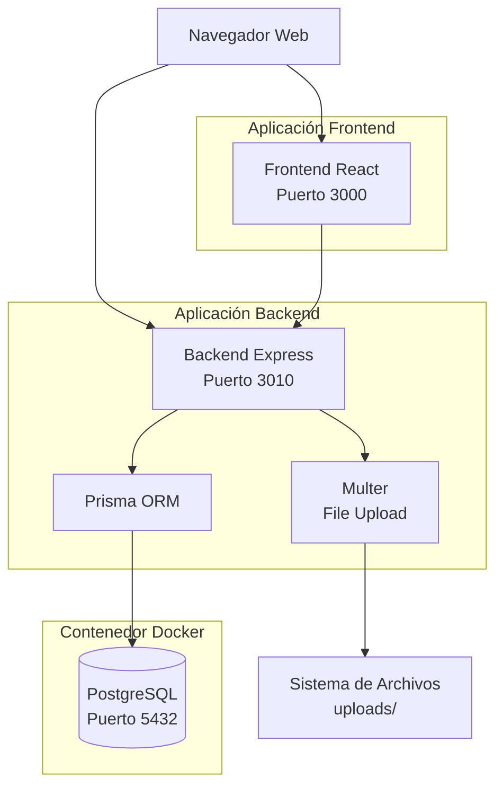
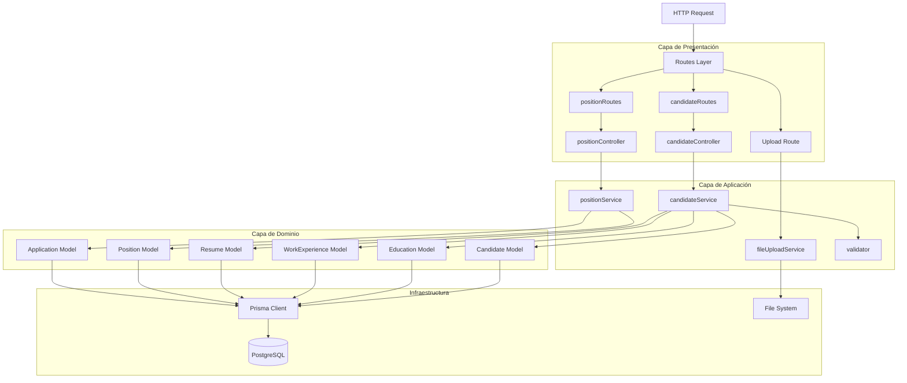

# Documento de Arquitectura

## Visión General de la Arquitectura

El sistema LTI sigue una **arquitectura monolítica en capas** inspirada en **Domain-Driven Design (DDD)**. La aplicación se divide en tres capas principales: **presentación**, **aplicación** y **dominio**, con una separación clara de responsabilidades.

### Tipo de Arquitectura

- **Monolito en capas**: Backend y frontend como aplicaciones separadas pero desplegadas juntas
- **Arquitectura orientada a capas**: Separación clara entre presentación, lógica de negocio y acceso a datos
- **Patrón MVC adaptado**: Controladores, Servicios y Modelos

## Componentes Principales y Responsabilidades

### Backend

#### Capa de Presentación (`presentation/`)
- **Controladores**: Manejan requests HTTP, validan entrada, formatean respuestas
  - `candidateController.ts`: Endpoints relacionados con candidatos
  - `positionController.ts`: Endpoints relacionados con posiciones
- **Rutas**: Definen endpoints y asocian controladores
  - `candidateRoutes.ts`: Rutas `/candidates/*`
  - `positionRoutes.ts`: Rutas `/position/*`

#### Capa de Aplicación (`application/`)
- **Servicios**: Orquestan lógica de negocio y coordinan entre modelos
  - `candidateService.ts`: Lógica de negocio para candidatos
  - `positionService.ts`: Lógica de negocio para posiciones
  - `fileUploadService.ts`: Gestión de subida de archivos
- **Validadores**: Validan datos de entrada según reglas de negocio
  - `validator.ts`: Validaciones centralizadas

#### Capa de Dominio (`domain/`)
- **Modelos**: Entidades de dominio con lógica de negocio
  - `Candidate.ts`, `Education.ts`, `WorkExperience.ts`, `Resume.ts`
  - `Position.ts`, `Application.ts`, `Interview.ts`
  - `Company.ts`, `Employee.ts`, `InterviewFlow.ts`, `InterviewStep.ts`, `InterviewType.ts`

#### Infraestructura
- **Prisma ORM**: Abstracción de acceso a datos
- **Express**: Framework web
- **Multer**: Manejo de archivos

### Frontend

#### Componentes (`components/`)
- `AddCandidateForm.js`: Formulario de creación de candidatos
- `FileUploader.js`: Componente de subida de archivos
- `Positions.tsx`: Listado y gestión de posiciones
- `RecruiterDashboard.js`: Dashboard principal

#### Servicios (`services/`)
- `candidateService.js`: Comunicación con API de candidatos
  - `uploadCV()`: Subida de CV
  - `sendCandidateData()`: Envío de datos de candidato

## Flujos Principales

### Flujo de Creación de Candidato

1. **Frontend**: Usuario completa formulario y sube CV
2. **Frontend Service**: `uploadCV()` sube archivo a `/upload`
3. **Backend**: `fileUploadService` guarda archivo y retorna ruta
4. **Frontend Service**: `sendCandidateData()` envía datos a `/candidates`
5. **Backend Controller**: `addCandidateController` recibe request
6. **Backend Service**: `addCandidate` valida y crea entidades
7. **Domain Model**: `Candidate.save()` persiste en BD mediante Prisma
8. **Response**: Retorna candidato creado con ID

### Flujo de Consulta de Candidatos por Posición

1. **Frontend**: Solicita candidatos de una posición
2. **Backend Controller**: `getCandidatesByPosition` recibe request
3. **Backend Service**: `getCandidatesByPositionService` consulta BD
4. **Prisma**: Query con joins a `Application`, `Candidate`, `Interview`
5. **Backend Service**: Calcula promedio de scores
6. **Response**: Retorna lista formateada

### Flujo de Actualización de Etapa de Entrevista

1. **Frontend**: Usuario actualiza etapa de candidato
2. **Backend Controller**: `updateCandidateStageController` recibe request
3. **Backend Service**: `updateCandidateStage` busca aplicación
4. **Domain Model**: `Application.save()` actualiza `currentInterviewStep`
5. **Response**: Retorna aplicación actualizada

## Diagramas C4

### C4 Nivel 1: Diagrama de Contexto



**Descripción**: El sistema interactúa con usuarios reclutadores a través de una aplicación web React. El backend Express expone una API REST que se comunica con PostgreSQL para datos y sistema de archivos para CVs.

### C4 Nivel 2: Diagrama de Contenedores



**Descripción**: 
- **Frontend React**: Aplicación SPA servida en desarrollo por react-scripts
- **Backend Express**: API REST con TypeScript
- **PostgreSQL**: Base de datos relacional en contenedor Docker
- **Sistema de Archivos**: Almacenamiento de CVs subidos

### C4 Nivel 3: Diagrama de Componentes (Backend)



**Descripción**: 
- **Capa de Presentación**: Rutas y controladores manejan HTTP
- **Capa de Aplicación**: Servicios orquestan lógica, validadores validan entrada
- **Capa de Dominio**: Modelos encapsulan lógica de negocio y acceso a datos
- **Infraestructura**: Prisma Client abstrae acceso a BD

## Decisiones de Diseño

### Patrones Aplicados

1. **Domain-Driven Design (DDD)**
   - Separación en capas de dominio, aplicación y presentación
   - Modelos de dominio con lógica de negocio
   - Agregados (Candidate como raíz de agregado)

2. **Service Layer Pattern**
   - Servicios de aplicación coordinan operaciones complejas
   - Separación entre lógica de negocio y presentación

3. **Repository Pattern (Implícito)**
   - Prisma Client actúa como repositorio
   - Modelos de dominio encapsulan acceso a datos

4. **DTO/Validator Pattern**
   - Validación centralizada en `validator.ts`
   - Separación de validación de lógica de negocio

### Trade-offs Detectados

1. **Modelos de Dominio con Acceso a Datos**
   - **Actual**: Modelos contienen métodos `save()` que usan Prisma directamente
   - **Trade-off**: Facilita uso pero acopla dominio a infraestructura
   - **Mejora sugerida**: Separar en repositorios explícitos

2. **Validación en Capa de Aplicación**
   - **Actual**: Validación en servicios antes de crear modelos
   - **Trade-off**: Validación separada de modelos puede llevar a inconsistencias
   - **Mejora sugerida**: Validación también en constructores de modelos

3. **Falta de Interfaces**
   - **Actual**: Sin interfaces TypeScript para servicios
   - **Trade-off**: Menor testabilidad y acoplamiento
   - **Mejora sugerida**: Definir interfaces para servicios

### Dependencias Clave

- **Prisma**: ORM que genera tipos TypeScript desde schema
- **Express**: Framework web minimalista
- **TypeScript**: Type safety y mejor DX
- **React**: Framework frontend declarativo
- **Docker**: Contenedorización de PostgreSQL

## Flujo de Datos

### Request Flow

```
HTTP Request
  ↓
Express Middleware (CORS, JSON parser, Prisma injection)
  ↓
Route Handler
  ↓
Controller (validación básica, manejo de errores)
  ↓
Service (lógica de negocio, validación)
  ↓
Domain Model (creación/actualización)
  ↓
Prisma Client (query a BD)
  ↓
PostgreSQL
```

### Response Flow

```
PostgreSQL
  ↓
Prisma Client (resultado tipado)
  ↓
Domain Model (instancia con lógica)
  ↓
Service (transformación/formateo)
  ↓
Controller (formato HTTP response)
  ↓
Express (serialización JSON)
  ↓
HTTP Response
```

## Escalabilidad y Rendimiento

### Consideraciones Actuales

- **Monolito**: Fácil de desarrollar y desplegar
- **Base de datos única**: Posible cuello de botella en escalado horizontal
- **Sin caché**: Todas las consultas van a BD
- **Archivos locales**: Limitado por almacenamiento del servidor

### Mejoras Sugeridas

- [ ] Implementar caché (Redis) para consultas frecuentes
- [ ] Migrar archivos a almacenamiento en la nube (S3, Azure Blob)
- [ ] Implementar paginación en endpoints de listado
- [ ] Considerar separación de lectura/escritura (CQRS)
- [ ] Añadir índices en consultas frecuentes

## Seguridad Arquitectónica

- **CORS**: Configurado para permitir solo `http://localhost:3000`
- **Validación**: Validación de entrada en múltiples capas
- **Type Safety**: TypeScript previene errores de tipo
- **SQL Injection**: Prisma previene inyección SQL mediante queries parametrizadas

## Observaciones

- La arquitectura actual es adecuada para un MVP y desarrollo inicial
- La separación en capas facilita mantenimiento y testing
- Existen oportunidades de mejora en desacoplamiento (repositorios, interfaces)
- El uso de Prisma simplifica acceso a datos pero acopla a PostgreSQL

