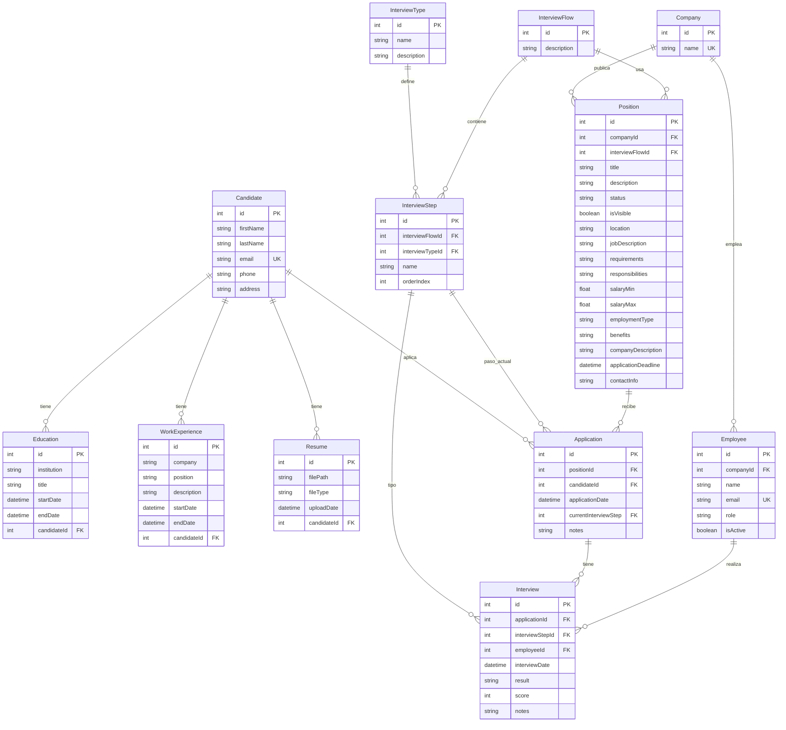

# Modelo de Datos

## Descripción General

El modelo de datos del sistema LTI está diseñado para gestionar el ciclo completo de reclutamiento: desde la captación de candidatos hasta el seguimiento de entrevistas y aplicaciones. El modelo sigue un diseño relacional normalizado utilizando PostgreSQL como base de datos.

## Arquitectura de Datos

El sistema utiliza **Prisma ORM** como capa de abstracción sobre PostgreSQL, proporcionando type-safety y facilitando las migraciones. El modelo está definido en `backend/prisma/schema.prisma`.

## Entidades Principales

### Candidate (Candidato)

Entidad central que representa a un candidato en el sistema.

**Atributos:**
- `id` (Int, PK, autoincrement): Identificador único
- `firstName` (String, VarChar(100)): Nombre
- `lastName` (String, VarChar(100)): Apellido
- `email` (String, VarChar(255), unique): Correo electrónico único
- `phone` (String?, VarChar(15)): Teléfono (opcional)
- `address` (String?, VarChar(100)): Dirección (opcional)

**Relaciones:**
- `educations`: Uno a muchos con `Education`
- `workExperiences`: Uno a muchos con `WorkExperience`
- `resumes`: Uno a muchos con `Resume`
- `applications`: Uno a muchos con `Application`

**Responsabilidades:**
- Almacenar información personal del candidato
- Actuar como agregado raíz para educación, experiencia y CVs
- Mantener integridad referencial con aplicaciones

### Education (Educación)

Representa el historial educativo de un candidato.

**Atributos:**
- `id` (Int, PK, autoincrement): Identificador único
- `institution` (String, VarChar(100)): Institución educativa
- `title` (String, VarChar(250)): Título obtenido
- `startDate` (DateTime): Fecha de inicio
- `endDate` (DateTime?): Fecha de finalización (opcional)
- `candidateId` (Int, FK): Referencia a Candidate

**Relaciones:**
- `candidate`: Muchos a uno con `Candidate`

### WorkExperience (Experiencia Laboral)

Representa el historial laboral de un candidato.

**Atributos:**
- `id` (Int, PK, autoincrement): Identificador único
- `company` (String, VarChar(100)): Empresa
- `position` (String, VarChar(100)): Cargo ocupado
- `description` (String?, VarChar(200)): Descripción (opcional)
- `startDate` (DateTime): Fecha de inicio
- `endDate` (DateTime?): Fecha de finalización (opcional)
- `candidateId` (Int, FK): Referencia a Candidate

**Relaciones:**
- `candidate`: Muchos a uno con `Candidate`

### Resume (Currículum)

Almacena información sobre los archivos de CV subidos.

**Atributos:**
- `id` (Int, PK, autoincrement): Identificador único
- `filePath` (String, VarChar(500)): Ruta del archivo
- `fileType` (String, VarChar(50)): Tipo MIME del archivo
- `uploadDate` (DateTime): Fecha de subida
- `candidateId` (Int, FK): Referencia a Candidate

**Relaciones:**
- `candidate`: Muchos a uno con `Candidate`

### Company (Empresa)

Representa las empresas que publican posiciones.

**Atributos:**
- `id` (Int, PK, autoincrement): Identificador único
- `name` (String, unique): Nombre de la empresa (único)

**Relaciones:**
- `employees`: Uno a muchos con `Employee`
- `positions`: Uno a muchos con `Position`

### Employee (Empleado)

Representa empleados de empresas que pueden realizar entrevistas.

**Atributos:**
- `id` (Int, PK, autoincrement): Identificador único
- `companyId` (Int, FK): Referencia a Company
- `name` (String): Nombre del empleado
- `email` (String, unique): Correo electrónico único
- `role` (String): Rol del empleado
- `isActive` (Boolean, default: true): Estado activo/inactivo

**Relaciones:**
- `company`: Muchos a uno con `Company`
- `interviews`: Uno a muchos con `Interview`

### Position (Posición)

Representa una posición laboral abierta.

**Atributos:**
- `id` (Int, PK, autoincrement): Identificador único
- `companyId` (Int, FK): Referencia a Company
- `interviewFlowId` (Int, FK): Referencia a InterviewFlow
- `title` (String): Título de la posición
- `description` (String): Descripción breve
- `status` (String, default: "Draft"): Estado (Draft, Published, Closed)
- `isVisible` (Boolean, default: false): Visibilidad pública
- `location` (String): Ubicación
- `jobDescription` (String): Descripción detallada del trabajo
- `requirements` (String?): Requisitos
- `responsibilities` (String?): Responsabilidades
- `salaryMin` (Float?): Salario mínimo
- `salaryMax` (Float?): Salario máximo
- `employmentType` (String?): Tipo de empleo
- `benefits` (String?): Beneficios
- `companyDescription` (String?): Descripción de la empresa
- `applicationDeadline` (DateTime?): Fecha límite de aplicación
- `contactInfo` (String?): Información de contacto

**Relaciones:**
- `company`: Muchos a uno con `Company`
- `interviewFlow`: Muchos a uno con `InterviewFlow`
- `applications`: Uno a muchos con `Application`

### InterviewType (Tipo de Entrevista)

Define tipos de entrevistas disponibles (técnica, cultural, etc.).

**Atributos:**
- `id` (Int, PK, autoincrement): Identificador único
- `name` (String): Nombre del tipo
- `description` (String?): Descripción

**Relaciones:**
- `interviewSteps`: Uno a muchos con `InterviewStep`

### InterviewFlow (Flujo de Entrevista)

Define un flujo completo de entrevistas para una posición.

**Atributos:**
- `id` (Int, PK, autoincrement): Identificador único
- `description` (String?): Descripción del flujo

**Relaciones:**
- `interviewSteps`: Uno a muchos con `InterviewStep`
- `positions`: Uno a muchos con `Position`

### InterviewStep (Paso de Entrevista)

Representa un paso específico dentro de un flujo de entrevistas.

**Atributos:**
- `id` (Int, PK, autoincrement): Identificador único
- `interviewFlowId` (Int, FK): Referencia a InterviewFlow
- `interviewTypeId` (Int, FK): Referencia a InterviewType
- `name` (String): Nombre del paso
- `orderIndex` (Int): Orden dentro del flujo

**Relaciones:**
- `interviewFlow`: Muchos a uno con `InterviewFlow`
- `interviewType`: Muchos a uno con `InterviewType`
- `applications`: Uno a muchos con `Application` (paso actual)
- `interviews`: Uno a muchos con `Interview`

### Application (Aplicación)

Representa la aplicación de un candidato a una posición.

**Atributos:**
- `id` (Int, PK, autoincrement): Identificador único
- `positionId` (Int, FK): Referencia a Position
- `candidateId` (Int, FK): Referencia a Candidate
- `applicationDate` (DateTime): Fecha de aplicación
- `currentInterviewStep` (Int, FK): Referencia a InterviewStep (paso actual)
- `notes` (String?): Notas adicionales

**Relaciones:**
- `position`: Muchos a uno con `Position`
- `candidate`: Muchos a uno con `Candidate`
- `interviewStep`: Muchos a uno con `InterviewStep` (paso actual)
- `interviews`: Uno a muchos con `Interview`

### Interview (Entrevista)

Representa una entrevista realizada.

**Atributos:**
- `id` (Int, PK, autoincrement): Identificador único
- `applicationId` (Int, FK): Referencia a Application
- `interviewStepId` (Int, FK): Referencia a InterviewStep
- `employeeId` (Int, FK): Referencia a Employee (entrevistador)
- `interviewDate` (DateTime): Fecha de la entrevista
- `result` (String?): Resultado (Aprobado, Rechazado, Pendiente)
- `score` (Int?): Puntuación numérica
- `notes` (String?): Notas de la entrevista

**Relaciones:**
- `application`: Muchos a uno con `Application`
- `interviewStep`: Muchos a uno con `InterviewStep`
- `employee`: Muchos a uno con `Employee`

## Diagrama de Entidades y Relaciones (ER)



## Patrones de Acceso a Datos

### Agregados

El modelo sigue el patrón de **Agregados de DDD**:

- **Agregado Candidate**: Raíz del agregado que contiene `Education`, `WorkExperience`, `Resume` y `Application`
  - Las operaciones sobre estos objetos deben pasar por `Candidate`
  - Mantiene consistencia transaccional

### Consultas Típicas

1. **Obtener candidato completo con relaciones**
```typescript
const candidate = await prisma.candidate.findUnique({
  where: { id },
  include: {
    educations: true,
    workExperiences: true,
    resumes: true,
    applications: {
      include: {
        position: { select: { id: true, title: true } },
        interviews: { select: { interviewDate: true, score: true } }
      }
    }
  }
});
```

2. **Obtener candidatos por posición**
```typescript
const applications = await prisma.application.findMany({
  where: { positionId },
  include: {
    candidate: true,
    interviews: true,
    interviewStep: true
  }
});
```

3. **Obtener flujo de entrevistas de una posición**
```typescript
const position = await prisma.position.findUnique({
  where: { id: positionId },
  include: {
    interviewFlow: {
      include: {
        interviewSteps: true
      }
    }
  }
});
```

## Consideraciones de Diseño

### Normalización
- Modelo normalizado hasta 3NF
- Evita redundancia de datos
- Mantiene integridad referencial

### Índices
- Índices únicos en campos `email` (Candidate, Employee)
- Índices únicos en `name` (Company)
- Claves foráneas indexadas automáticamente por Prisma

### Constraints
- Validación a nivel de base de datos mediante Prisma
- Constraints de unicidad en campos críticos
- Validación de tipos mediante TypeScript + Prisma

### Migraciones
- Migraciones versionadas en `backend/prisma/migrations/`
- Historial completo de cambios de esquema
- Soporte para rollback mediante Prisma

## Ejemplos de Uso

### Crear Candidato con Relaciones
```typescript
const candidate = new Candidate({
  firstName: "Juan",
  lastName: "Pérez",
  email: "juan.perez@example.com",
  educations: [
    { institution: "Universidad", title: "Ingeniería", startDate: "2010-01-01" }
  ],
  workExperiences: [
    { company: "Empresa", position: "Desarrollador", startDate: "2015-01-01" }
  ]
});
await candidate.save();
```

### Actualizar Etapa de Entrevista
```typescript
const application = await Application.findOneByPositionCandidateId(applicationId, candidateId);
application.currentInterviewStep = newStepId;
await application.save();
```

## Mejoras Futuras Sugeridas

- [ ] Implementar soft deletes para mantener historial
- [ ] Añadir campos de auditoría (createdAt, updatedAt, createdBy)
- [ ] Considerar desnormalización para consultas frecuentes
- [ ] Implementar versionado de CVs (historial de cambios)
- [ ] Añadir índices compuestos para consultas frecuentes

